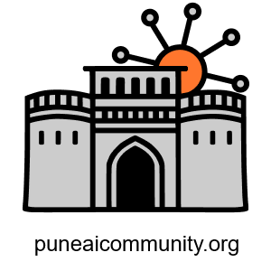

# Pune AI Community (PAIC) 👋

**Artificial Intelligence — from classes to masses**

## Vision & Mission
* **Vision:** Make Pune a global AI hub, diverse, practical, and impactful.
* **Mission:** Democratize AI knowledge via community events, projects, and mentoring.

जे जे आपणासि ठावे। ते ते इतरांसि शिकवावे। शहाणे करून सोडावे सकळ जन।। - श्री समर्थ रामदासस्वामी 

(What is known to you, teach that to others. Make all people wise.)

## What we do
* Online seminars: **LetsAI** (LOSS): short, accessible talks.
* Hands-on in-person workshops: **Zero2Hero** (ZOWS): practical training, quizzes, giveaways.
* Tentative Program List [here](./PAIC_ProgramList_2026.md)
* Showcases for startups, job/hiring posts, and campus collaborations.
* Partner programs with institutions, local tech communities & sponsors.

## Quick links & accounts (primary contacts)
* Website: puneaicommunity.org
* LinkedIn page: https://www.linkedin.com/company/pune-ai-community
* Email: puneaicommunity@gmail.com
* Luma Event manager:https://luma.com/puneaicommunity  
* Medium Blogs: https://medium.com/pune-ai-community 
* GitHub repository: https://github.com/puneaicommunity 
* YouTube channel:  https://www.youtube.com/@puneaicommunity 
* Instagram: https://www.instagram.com/puneaicommunity/
* Twitter X: https://x.com/puneaicommunity
* WhatsApp Community:  https://chat.whatsapp.com/LluOrhyEzuQLDr25ixZGQN?mode=wwt 

<!-- 
## Code of Conduct & Legal
* **Code of Conduct:** All events follow PAIC CoC — respectful, harassment-free. Report CoC violations to `puneaicommunity@gmail.com`.
* **Speaker release & consent forms** stored in `/legal/`.
* **License:** Content in this repo is `CC-BY-SA` unless stated otherwise. Check `/LICENSE` for details.

## How to contribute
1. **Events / Talks / Ideas**
   * Create an Issue: `type: event-proposal` with title, short abstract, preferred date, modality.
   * Core team reviews; if approved roles get assigned (Host, Moderator, Promo, Tech).
2. **Code / Docs / Templates**
   * Fork → branch → PR against `main`. Use templates in `/templates/`.
   * Small change? Open an Issue or Draft PR.
3. **Social media posts / assets**
   * Drop content in `/content/queue/` or create Issue `social: <platform>`.
   * Use prompt: `PAIC: Social Media posts` in gKeep / zNotes for drafts.
4. **Add yourself to speaker/volunteer roster**
   * Email `puneaicommunity@gmail.com` with link to a 20+ minute talk (YouTube) + topics comfortable with + email.
   * Or open Issue `speaker-application` with same details.

## How to be a speaker
* Submit event idea via Issue or email with: bio, photo, abstract, preferred date, format, 20+ min sample talk link.
* If accepted: receive **Speaker Packet** (guidelines, slide template, consent form).
* Dry run required for online talks; formal attire recommended for offline showcases.
* Recording rights: specified in the Speaker Packet.

## How to be a volunteer
* Roles: registration, timekeeper, photo/video, tech support, promo, host/moderator.
* Apply: email `puneaicommunity@gmail.com` or open Issue `volunteer-<role>`.
* Volunteers: expected to attend briefings, follow checklists, and represent PAIC Code of Conduct.

## Mentoring scheme (short)
* **What:** Pairing aspiring AI builders with mentors (engineers/researchers) for project guidance and career transition.
* **Apply:** Issue `mentee-application` (skills, goals, availability) or `mentor-offer` (expertise, capacity).
* **Match:** 1–3 month cycles, defined deliverables, monthly reviews; final showcase to community.

## How to sponsor an event
* **Sponsorship benefits:** logo on website/banner, mentions in promos, sponsor slide, priority demo slot.
* **Criteria:** Event must be open to all (free/paid ok).
* **Process:** Email `puneaicommunity@gmail.com` with package interest. Provide logo and required copy.
* **Revenue split for ZOWS:** default: 2/3 ticket profits to the speaker, remainder to PAIC (negotiable by agreement).
* Signed Sponsor Agreement and invoice required before event.
-->

## Be a Community Partner
* Requirement: Open event to public
* Include PAIC logo on website/banner and tag PAIC on promos
* Agree to cross-promotion (we will post on all PAIC handles)
* Provide sponsor/promotional assets and access to event page for PAIC posting.
* Benefits: mutual promo, speaker exchange, partner slots.

<!--
## Event types & pricing (TL;DR)
* **LetsAI (LOSS)** — online seminars; free/low cost (₹100 for hybrid ticketing model for recorded access).
* **Zero2Hero (ZOWS)** — offline workshops (4–8 hrs); charged when required. Includes snacks.
* **Hybrid / Showcases** — follow hybrid checklist.

**puneaicommunity/puneaicommunity** is a ✨ _special_ ✨ repository because its `README.md` (this file) appears on your GitHub profile.

Here are some ideas to get you started:

- 🔭 I’m currently working on ...
- 🌱 I’m currently learning ...
- 👯 I’m looking to collaborate on ...
- 🤔 I’m looking for help with ...
- 💬 Ask me about ...
- 📫 How to reach me: ...
- 😄 Pronouns: ...
- ⚡ Fun fact: ...
-->
